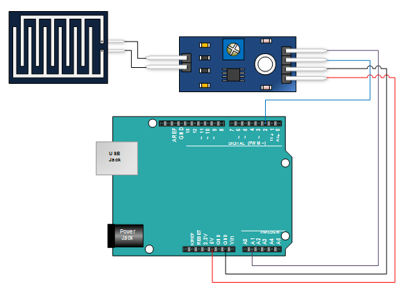

# Rain Drop Sensor Library for Arduino

## What is it?

This library (with examples) is designed to be integrated in projects using any kind of RainDrop sensors (analog or/and digital).
It retrieves analog/digital value from the sensor and gives rain status.

## How to install

1) Download <a target="_blank" href="https://github.com/QuentinCG/Arduino-Rain-Drop-Sensor-Library/releases/download/1.0.0/RainDropSensor_v1_0_0.zip">latest release</a>

2) On your Arduino IDE, click "Sketch" menu and then "Include Library > Add .ZIP Libraries"

3) You can now use the library for your project or launch an example ("File > Examples")

## How to connect Raindrop sensor to your Arduino

Most Rain drop sensors have an analog and/or a digital output.

All rain drop sensors behave the same way:

Raindrop Sensor  | Arduino
-------- |  --------
VCC      | 5V
GND      | GND
A0       | A1 (or any other analog pin)
D0       | D2 (or any other digital pin)

(<a target="_blank" href="http://henrysbench.capnfatz.com/henrys-bench/arduino-sensors-and-input/arduino-rain-sensor-module-guide-and-tutorial/">Source image</a>)

## Examples

Two examples are provided with this library:

### Read digital value from sensor
<a target="_blank" href="https://github.com/QuentinCG/Arduino-Rain-Drop-Sensor-Library/blob/master/RainDropSensor/examples/DigitalRainDrop/DigitalRainDrop.ino">Link to source code</a>

### Read analog value from sensor
<a target="_blank" href="https://github.com/QuentinCG/Arduino-Rain-Drop-Sensor-Library/blob/master/RainDropSensor/examples/AnalogRainDrop/AnalogRainDrop.ino">Link to source code</a>

## License

This project is under MIT license. This means you can use it as you want (just don't delete the library header).

## Contribute

If you want to add more examples or improve the library, just create a pull request with proper commit message and right wrapping.